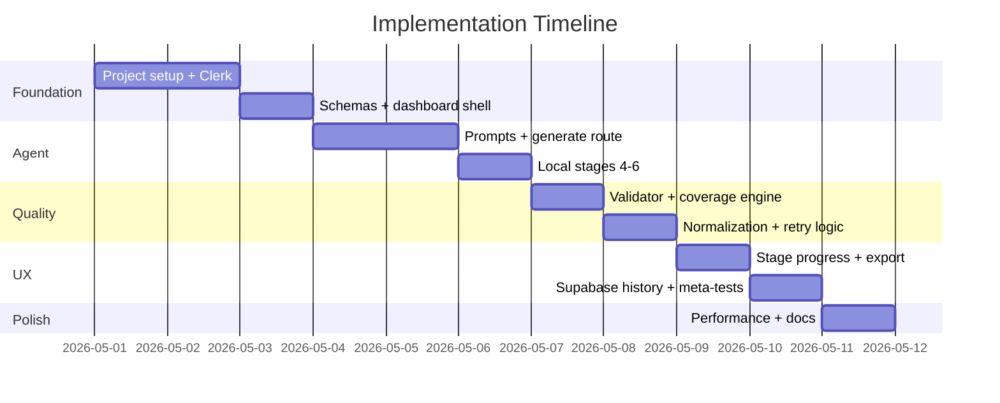

# Solution Plan / Implementation Plan

**Project:** OpenMRS AI Healthcare Test Automation Agent  
**Version:** 1.0  
**Date:** May 2026

---

## 1. Executive Summary

This plan describes how Group 22 delivered a **Next.js 15 monolith** that orchestrates a six-stage AI agent for OpenMRS test automation. The implementation prioritizes a visible agentic workflow, strict schema validation, synthetic-data safety, and a polished dashboard experience suitable for hackathon demonstration and future extension.

---

## 2. Step-by-Step Approach

### Phase 1 — Foundation (Days 1–2)

1. Initialize Next.js 15 App Router project with TypeScript and Tailwind CSS.
2. Integrate Clerk authentication with middleware protecting `/dashboard` and API routes.
3. Define Zod schemas for AgentOutput, TestCase, SyntheticData, AutomationSkeleton, CoverageReport, and SafetyChecklist.
4. Build landing page, sign-in/sign-up, and dashboard shell with sidebar navigation.

### Phase 2 — Agent Core (Days 2–4)

1. Author stage prompts in `lib/prompts.ts` with OpenMRS vocabulary and guardrails.
2. Implement `POST /api/agent/generate` orchestrator with JSON-mode LLM calls.
3. Combine stages 1+2 (Requirement Analyzer + Risk Planner) into one LLM round-trip.
4. Add defensive JSON parsing, per-item test case filtering, and stage retry on rate limits.
5. Implement local stages 4–6: synthetic data templates, automation templates, deterministic coverage/safety.

### Phase 3 — Quality & Validation (Days 4–5)

1. Build `lib/validator.ts` — test case quality engine with scoring and suggestions.
2. Build `lib/coverage-engine.ts` — multi-dimensional coverage analysis.
3. Add `lib/normalize.ts` for LLM output correction (IDs, entities, synthetic flags).
4. Integrate validation report and coverage breakdown panels in dashboard UI.

### Phase 4 — UX & Persistence (Days 5–6)

1. Implement StageProgress component with heuristic timer reconciled to server trace.
2. Add export utilities (Markdown, JSON, CSV) and copy/download toolbar.
3. Integrate Supabase for generation history with graceful fallback.
4. Add localStorage session cache for in-progress dashboard state (`lib/generation-cache.ts`).
5. Build GenerationHistoryPanel and Agent QA meta-testing page.

### Phase 5 — Hardening & Submission (Days 6–7)

1. Optimize pipeline latency (local stages, combined LLM call, token caps).
2. Align client/server timeouts; add model selector (OpenAI + Groq).
3. Fix UI edge cases (re-validate button, hydration warnings, history panel layout).
4. Produce hackathon submission documentation in `docs/`.
5. Add Vitest meta-tests, GitHub Actions CI, and Playwright smoke skeleton.
6. Split `lib/generation-cache.ts` from `lib/utils.ts` for lighter client bundles.

---

## 3. Key Modules and Tech Stack

### Tech Stack

| Layer | Technology |
|-------|------------|
| Framework | Next.js 15 (App Router) |
| Language | TypeScript 5.7 |
| UI | React 19, Tailwind CSS 3, Lucide icons |
| Auth | Clerk (`@clerk/nextjs`) |
| LLM | OpenAI SDK (OpenAI + Groq endpoints) |
| Validation | Zod 4 |
| Database | Supabase (PostgreSQL, optional) |
| Deployment | Vercel (recommended) |

### Module Map

```
app/
├── dashboard/page.tsx          # Main workspace (generate, review, export)
├── dashboard/agent-tests/      # Meta-testing catalog UI
├── api/agent/generate/         # Six-stage pipeline orchestrator
├── api/agent/history/          # List + load persisted generations
└── layout.tsx                  # ClerkProvider, global styles

lib/
├── prompts.ts                  # Stage system/user prompts + combined analysis
├── schemas.ts                  # Zod contracts for all artifacts
├── normalize.ts                # LLM output normalization
├── validator.ts                # Test case QA engine
├── coverage-engine.ts          # Coverage scoring dimensions
├── deterministic-coverage.ts   # Coverage report + safety checklist
├── synthetic-data-templates.ts # Local Stage 4 generator
├── automation-templates.ts     # Local Stage 5 generator
├── llm-models.ts               # Model catalog (OpenAI + Groq)
├── llm-client.ts               # Provider resolution
├── history.ts                  # Supabase persistence
├── export.ts                   # Markdown / JSON / CSV renderers
├── sample-requirements.ts      # Quick-start healthcare stories
└── agent-self-tests.ts         # Meta-test case catalog

components/
├── StageProgress.tsx           # Six-stage stepper + progress bar
├── TestCaseCard.tsx            # Individual test case display
├── SyntheticDataViewer.tsx     # Synthetic patient/visit data
├── CoverageBreakdownPanel.tsx  # Coverage score + gaps
├── ValidationReportPanel.tsx   # QA checks + re-validate
├── GenerationHistoryPanel.tsx  # Sidebar history list
└── SelfTestsPanel.tsx          # Agent QA summary
```

---

## 4. Implementation Sequence



### Critical Path

1. **Schemas first** — All stages converge on `AgentOutput`; defining contracts early prevented rework.
2. **Combined LLM call** — Merging stages 1+2 cut ~10–15s latency per run.
3. **Local stages 4–6** — Eliminated three LLM calls; improved reliability and cost.
4. **Normalization layer** — LLM outputs are corrected before strict Zod parsing.
5. **Dashboard as single workspace** — Reduced navigation friction for judges.

---

## 5. Team Responsibilities (Assumed Roles)

| Role | Responsibilities | Primary Artifacts |
|------|------------------|-------------------|
| **Tech Lead / Architect** | Architecture, schemas, API design, code review | `lib/schemas.ts`, `app/api/agent/generate/route.ts` |
| **AI / Prompt Engineer** | Stage prompts, guardrails, model tuning | `lib/prompts.ts`, `lib/llm-models.ts` |
| **Full-Stack Developer** | Dashboard UI, auth, export, history | `app/dashboard/*`, `components/*` |
| **QA Engineer** | Meta-tests, validator rules, acceptance criteria | `lib/validator.ts`, `lib/agent-self-tests.ts` |
| **DevOps / Release** | Env config, Supabase migrations, Vercel deploy | `supabase/`, `docs/7-deployment-guide.md` |
| **Product Owner** | Requirements grooming, sample stories, demo script | `docs/1-groomed-requirements.md`, `lib/sample-requirements.ts` |

*Note: In a solo or pair hackathon setting, one developer may cover multiple roles using Cursor AI-assisted development.*

---

## 6. Risk Mitigation During Implementation

| Risk | Mitigation |
|------|------------|
| LLM JSON malformed | Markdown fence stripping, normalization, per-item drop |
| LLM timeout | 55s per-request timeout, 120s route maxDuration, client 130s abort |
| Rate limits (429) | Exponential backoff retry in `runStageWithRetry` |
| PHI in outputs | Prompt refusals, synthetic flag enforcement, safety checklist |
| Schema drift | Single source of truth in `lib/schemas.ts` |
| Supabase RLS blocking inserts | Service role key + RLS disabled migration |

---

## 7. Definition of Done

- [ ] User can sign in, generate a test plan from a sample requirement, and review all tabs
- [ ] Six-stage trace visible with timings
- [ ] Export works in all three formats
- [ ] Validator and coverage panels display scores
- [ ] 10 agent meta-tests documented and accessible in UI
- [ ] README and seven submission docs complete
- [ ] Application deployable to Vercel with documented env vars

---

## 8. Related Documents

- [Groomed Requirements](./1-groomed-requirements.md)
- [Architecture](./3-architecture.md)
- [Deployment Guide](./7-deployment-guide.md)
