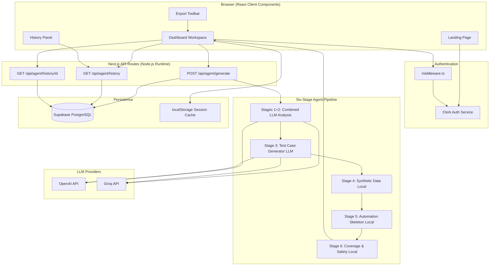
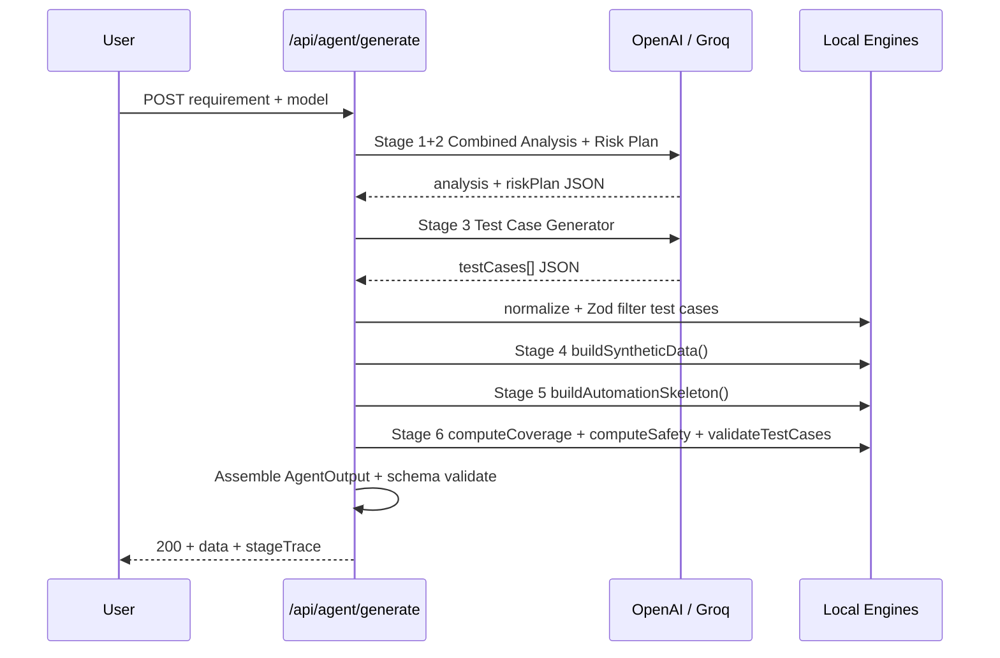
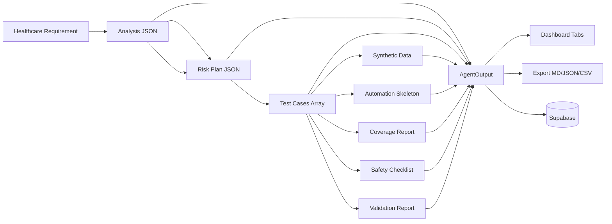
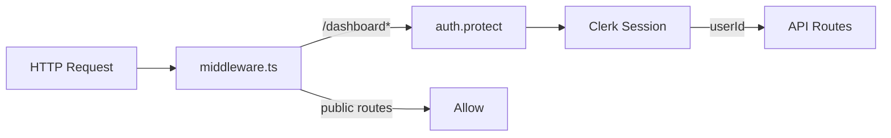

# Product / Technical Architecture Document

**Project:** OpenMRS AI Healthcare Test Automation Agent  
**Version:** 1.0  
**Date:** May 2026

---

## 1. Architecture Overview

The application is a **Next.js 15 monolith** using the App Router. The browser dashboard calls authenticated API routes that orchestrate a hybrid **LLM + deterministic** agent pipeline. Optional Supabase persistence stores generation history keyed by Clerk user IDs.

---

## 2. High-Level Architecture Diagram



---

## 3. Frontend Architecture

### Pages

| Route | Type | Purpose |
|-------|------|---------|
| `/` | Server | Marketing landing with sign-in CTA |
| `/sign-in`, `/sign-up` | Clerk | Authentication |
| `/dashboard` | Client | Main agent workspace |
| `/dashboard/agent-tests` | Server + Client | Full meta-testing catalog |
| `/dashboard/*` | Placeholder | Future modules (requirements, settings) |

### Dashboard Components

The dashboard (`app/dashboard/page.tsx`) is a single-page workspace:

1. **RequirementCard** — Textarea, model selector, sample chips, Generate button
2. **StageProgress** — Six-step horizontal stepper with heuristic progress bar
3. **ExportToolbar** — Copy Markdown/JSON/CSV, download report
4. **ResultTabs** — Test Cases | Synthetic Data | Automation | Coverage & Safety
5. **CoverageBreakdownPanel** — Multi-dimensional coverage score
6. **ValidationReportPanel** — QA checks with Re-validate action
7. **GenerationHistoryPanel** — Sidebar list of past runs
8. **SelfTestsPanel** — Compact meta-test summary with link to full page

### State Management

- React `useState` / `useEffect` for generation lifecycle
- `localStorage` per Clerk user for session restore (`lib/generation-cache.ts`)
- `lib/utils.ts` — Tailwind `cn()` helper only (kept lightweight for client components)
- Server remains source of truth for generation results and history

---

## 4. Backend (API Routes)

### `POST /api/agent/generate`

**Runtime:** Node.js (`export const runtime = "nodejs"`)  
**Max duration:** 120 seconds  
**Auth:** Clerk `auth()` — returns 401 if unauthenticated

**Request body:**

```json
{
  "requirement": "string (20–8000 chars)",
  "requirementId": "optional string",
  "model": "gpt-4o-mini | gpt-4o | ... | llama-3.3-70b-versatile"
}
```

**Response (success):**

```json
{
  "ok": true,
  "data": { /* AgentOutput */ },
  "stageTrace": [ /* per-stage status, durationMs */ ],
  "validation": { "passed": true, "issues": [] },
  "warnings": { "droppedTestCases": [] },
  "historyId": "uuid | null"
}
```

### `GET /api/agent/history`

Returns `{ ok, configured, items[] }` — summaries for signed-in user.

### `GET /api/agent/history/[id]`

Returns full generation record reconstructed as `AgentOutput`.

---

## 5. AI Agent Workflow (Six Stages)

The UI displays **six logical stages**. The server executes **two LLM calls** plus **three local computation stages**.



### Stage Details

| # | Stage | Execution | Module |
|---|-------|-----------|--------|
| 1 | Requirement Analyzer | LLM (combined) | `lib/prompts.ts` |
| 2 | Risk & Privacy Planner | LLM (combined) | `lib/prompts.ts` |
| 3 | Test Case Generator | LLM + retry | `lib/prompts.ts`, `lib/normalize.ts` |
| 4 | Synthetic Data Generator | **Local** | `lib/synthetic-data-templates.ts` |
| 5 | Automation Skeleton Writer | **Local** | `lib/automation-templates.ts` |
| 6 | Coverage & Safety Reviewer | **Local** | `lib/deterministic-coverage.ts`, `lib/validator.ts` |

### LLM Configuration

| Parameter | Value |
|-----------|-------|
| Default model | `gpt-4o-mini` |
| Temperature | 0.2 |
| Response format | JSON object |
| Per-request timeout | 55 seconds |
| Rate limit handling | Up to 2 attempts with backoff |

---

## 6. Data Flow



### Schema Contract

All artifacts conform to Zod schemas in `lib/schemas.ts`:

- `TestCase` — id, scenario, category, steps, entities, tags, priority
- `SyntheticData` — patients, users, visits, encounters (all synthetic)
- `AutomationSkeleton` — playwright + restAssured sections
- `CoverageReport` — byCategory, byEntity, byWorkflow, gaps, coveragePct
- `SafetyChecklist` — items with pass/warn/fail and must/should severity
- `TestCaseValidationReport` — score, checks, suggestions, coverageBreakdown

---

## 7. Database (Supabase)

### Table: `generations`

| Column | Type | Description |
|--------|------|-------------|
| id | uuid | Primary key |
| user_id | text | Clerk user ID |
| requirement | text | Original requirement text |
| model | text | LLM model id used |
| test_cases | jsonb | Generated test cases |
| synthetic_data | jsonb | Synthetic data payload |
| automation_skeleton | jsonb | Playwright + REST skeletons |
| coverage | jsonb | Coverage report |
| safety | jsonb | Safety checklist |
| created_at | timestamptz | Insert timestamp |

**Access pattern:** Server-side only via `SUPABASE_SERVICE_ROLE_KEY`. Row ownership enforced in application code (`user_id` filter), not RLS.

**Migrations:** `supabase/schema.sql`, `supabase/migrations/002_add_missing_columns.sql`, `003_disable_rls.sql`

---

## 8. Authentication (Clerk)



- **Protected:** `/dashboard(.*)`, API routes via Clerk middleware matcher
- **Public:** `/`, `/sign-in`, `/sign-up`
- **Env vars:** `NEXT_PUBLIC_CLERK_PUBLISHABLE_KEY`, `CLERK_SECRET_KEY`, routing URLs

---

## 9. Integrations

| Integration | Purpose | Required |
|-------------|---------|----------|
| Clerk | User authentication | Yes |
| OpenAI | Paid LLM models (GPT-4o, GPT-4o Mini) | Yes (for default model) |
| Groq | Free-tier LLM models (Llama, Gemma) | Optional |
| Supabase | Generation history | Optional |

---

## 10. Deployment Strategy

### Recommended: Vercel

- Single Next.js deployment (frontend + API routes)
- Set all env vars in Vercel project settings
- `maxDuration = 120` supported on Pro plan; Hobby may need Groq + shorter requirements
- Add production URL to Clerk allowed domains

### Environment Separation

| Environment | Clerk | Supabase | LLM Keys |
|-------------|-------|----------|----------|
| Local | Test keys | Dev project or none | Developer keys |
| Production | Production app | Production project | Restricted service keys |

### CI/CD (GitHub Actions)

Implemented in `.github/workflows/ci.yml`:

| Job | Steps |
|-----|-------|
| **build-and-test** | `npm ci` → `npm run lint` → `npm test` (Vitest) → `npm run build` |
| **playwright-smoke** | `automation/playwright` smoke tests (TC-SMOKE-001/002) |

**Build env:** CI uses syntactically valid Clerk placeholder keys (`pk_test_YWNjb3VudC5kZW1vJA==`) so Next.js can prerender pages during `next build` without real Clerk credentials.

**Local verification:**

```bash
npm test
npm run lint
npm run build
cd automation/playwright && npm install && npm test
```

Preview deployments on pull requests via Vercel (optional).

---

## 11. Security Architecture

| Control | Implementation |
|---------|----------------|
| Authentication | Clerk session on all agent endpoints |
| Authorization | History queries scoped by `userId` |
| Secret management | API keys in env vars only; `.env.local` gitignored |
| Input validation | Zod on request body and AgentOutput |
| Output safety | Synthetic flag enforcement, safety checklist, PHI refusal prompts |
| Transport | HTTPS in production (Vercel default) |

---

## 12. Related Documents

- [Implementation Plan](./2-implementation-plan.md)
- [Test Plan](./4-test-plan.md)
- [Deployment Guide](./7-deployment-guide.md)
