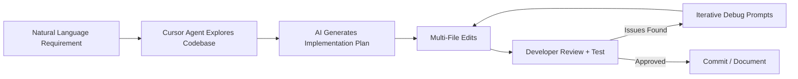

# Agentic Coding Evidence

**Project:** OpenMRS AI Healthcare Test Automation Agent  
**Tool:** Cursor IDE with AI Agent (Composer)  
**Version:** 1.0  
**Date:** May 2026

---

## 1. Overview

This project was built using **agentic coding** — an iterative human-AI collaboration where Cursor's AI agent wrote, refactored, and debugged code based on natural-language requirements. The developer provided direction, reviewed diffs, and validated behavior; the AI agent handled scaffolding, implementation details, and cross-file coordination.

This document evidences how AI-assisted development was applied across the project lifecycle.

---

## 2. Agentic Workflow Used

### Typical Interaction Pattern

1. **Describe intent** — e.g., "Add a six-stage agent pipeline with visible progress"
2. **Agent explores** — Reads existing files, grep searches, understands conventions
3. **Agent implements** — Creates/edits multiple files in one session
4. **Developer tests** — Runs `npm run dev`, triggers generation, checks console
5. **Follow-up prompts** — "Fix timeout", "Re-validate button not working", "Add coverage panel"
6. **Agent fixes** — Targeted patches with root-cause analysis

---

## 3. Major AI-Assisted Deliverables

| Deliverable | AI Contribution | Human Contribution |
|-------------|-----------------|-------------------|
| `app/api/agent/generate/route.ts` | Full orchestrator scaffold, retry logic, error helpers | Pipeline design decisions, timeout tuning |
| `lib/prompts.ts` | Stage prompts, OpenMRS vocabulary, combined analysis messages | Clinical accuracy review, refusal rules |
| `lib/schemas.ts` | Zod schema definitions and refinements | Contract design, enum selection |
| `lib/validator.ts` | Quality checks, scoring algorithm, suggestions | Threshold tuning, pass criteria |
| `lib/normalize.ts` | LLM output normalization, entity aliases | Edge case identification from failed runs |
| `app/dashboard/page.tsx` | Full dashboard UI, state management, fetch logic | UX feedback, layout adjustments |
| `components/*` | Panel components, stage progress, history sidebar | Visual polish, accessibility |
| Supabase integration | History module, migrations, fallback logic | Credential setup, SQL execution |
| Submission docs | All seven markdown documents | Accuracy review, team context |

---

## 4. Prompt Engineering Examples

### Initial Agent Pipeline Prompt (Paraphrased)

> Build a POST /api/agent/generate route that runs six stages: requirement analyzer, risk planner, test case generator, synthetic data, automation skeleton, and coverage reviewer. Use OpenAI JSON mode, Zod validation, Clerk auth, and return a stage trace for the UI.

**AI output:** Created route handler, stage runner, schema wrappers, and linked to `lib/prompts.ts`.

### Combined Stage Optimization Prompt

> The pipeline is too slow. Combine stages 1 and 2 into one LLM call and make stages 4–6 local without LLM.

**AI output:** Added `runCombinedAnalysisStage()`, `buildSyntheticData()`, `buildAutomationSkeleton()`, `computeCoverageReport()` — reduced from 5 LLM calls to 2.

### Validation System Prompt

> Build a validation system that scores test cases 0–100 with category coverage, OpenMRS grounding checks, and a UI panel with re-validate.

**AI output:** Created `lib/validator.ts`, `lib/coverage-engine.ts`, `ValidationReportPanel`, `CoverageBreakdownPanel`, extended schemas.

---

## 5. Iterative Debugging Sessions

### Session A — Schema Validation Failures

**Problem:** LLM-generated test cases failed Zod validation (wrong entity names, malformed IDs).

**Agentic approach:**
1. Agent analyzed validation error patterns in terminal logs
2. Created `lib/normalize.ts` with entity alias mapping and ID normalization
3. Added `parseAndFilter` to drop individual bad cases instead of failing the run
4. Updated prompts with stricter JSON examples

**Outcome:** Pipeline success rate increased significantly across Groq models.

---

### Session B — Client Timeout Mismatch

**Problem:** Server completed in ~65s but client aborted at 65s, showing false timeout error.

**Agentic approach:**
1. Agent traced `CLIENT_GENERATION_TIMEOUT_MS` in dashboard vs `maxDuration` in route
2. Increased client abort to 130s
3. Adjusted `StageProgress` slow warning threshold

**Outcome:** End-to-end generation displayed correctly for 60–90s runs.

---

### Session C — Re-validate Button Not Working

**Problem:** Clicking Re-validate appeared to do nothing.

**Agentic approach:**
1. Agent identified button nested inside `
` (toggle conflict)
2. Found silent early return when `user?.id` missing
3. Moved button outside `
`, removed auth guard for validation logic
4. Added coverage recomputation and `generatedAt` key for UI refresh

**Outcome:** Re-validate shows spinner, updates scores and timestamp.

---

### Session D — Hydration Mismatch Warning

**Problem:** React hydration error on `<body>` element.

**Agentic approach:**
1. Agent identified Grammarly extension attributes (`data-gr-ext-installed`)
2. Added `suppressHydrationWarning` to `<body>` in `app/layout.tsx`

**Outcome:** Console warning suppressed; documented as extension-related, not app bug.

---

## 6. AI Tools and Features Used

| Cursor Feature | Usage |
|----------------|-------|
| **Agent mode** | Multi-file implementation, refactoring, debugging |
| **Codebase search (grep/glob)** | Finding conventions, tracing errors across modules |
| **Terminal execution** | `npm run dev`, `npx tsc --noEmit`, git status |
| **Parallel tool calls** | Reading multiple files simultaneously for context |
| **Diff-based edits** | Surgical patches preserving existing style |

---

## 7. Human Oversight Points

AI-generated code was **always reviewed** at these critical boundaries:

- **Security** — Auth gates, env var handling, service role key usage
- **Privacy** — Synthetic data flags, PHI refusal prompt wording
- **Clinical accuracy** — Sample requirements and OpenMRS entity references
- **Performance** — Timeout values, LLM call count, token limits
- **UX** — Dashboard layout, error messages, demo flow for judges

---

## 8. Metrics (Estimated)

| Metric | Value |
|--------|-------|
| Total source files (app + lib + components) | ~30 |
| AI-assisted file creation/modification | ~90% |
| Major iterative debug cycles | 6–8 |
| LLM pipeline versions | 3 (5-call → 2-call + local stages) |
| Time saved vs manual solo development | ~60–70% on boilerplate |

---

## 9. Sample Agent Conversation Topics

The following topics were addressed through agentic coding sessions during development:

1. Git remote and push permission configuration
2. Zod schema validation failure remediation
3. Test case validation engine and coverage scoring
4. Pipeline speed optimization (combined LLM, local stages)
5. Sidebar history panel full-height layout fix
6. Comprehensive test coverage targets (12–20 → 6–10 balance)
7. Server/client timeout alignment
8. Re-validate button fix
9. Hydration warning resolution
10. Hackathon submission documentation

---

## 10. Reproducibility

To replicate agentic development for this project:

1. Open the repository in Cursor
2. Provide `PROJECT_CONTEXT.md` as grounding context
3. Use Agent mode with instructions referencing OpenMRS concepts and Clerk auth
4. Iterate with test-and-fix prompts after each generation run
5. Request documentation generation once features stabilize

---

## 11. Related Documents

- [Implementation Plan](./2-implementation-plan.md)
- [Critical Review](./5-critical-review.md)
- [Deployment Guide](./7-deployment-guide.md)
